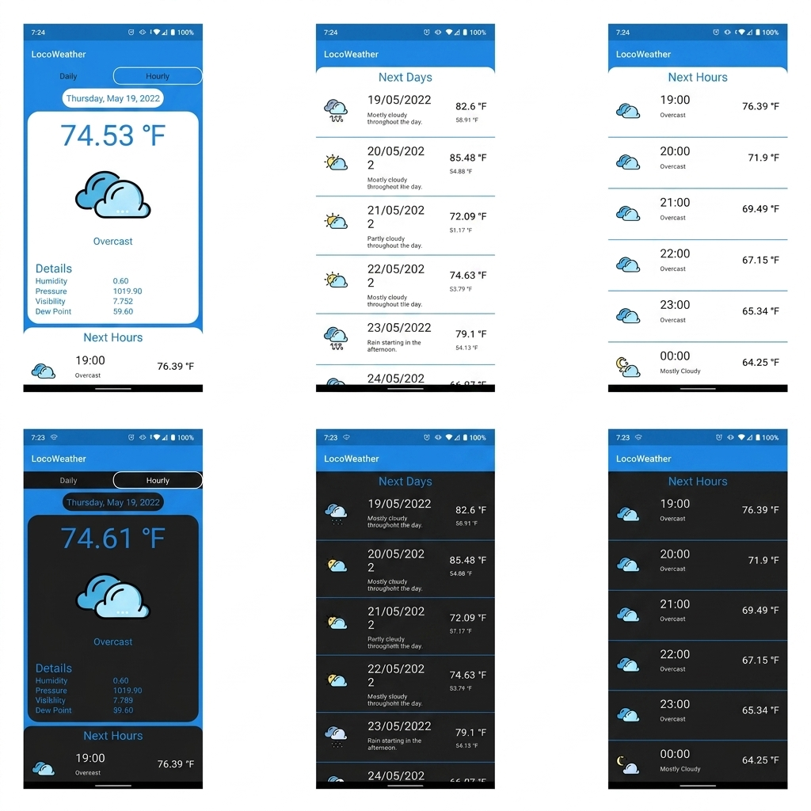

# 🌩️ LocoWeather

 


**LocoWeather** is a modern, lightweight, natively-built Android application engineered entirely with Jetpack Compose. It efficiently surfaces live atmospheric weather conditions, delivering detailed daily breakdowns and dynamic hourly forecasting via the OpenWeatherMap API—complete with advanced location resolving and highly persistent custom configurations!

<br/>

<div align="center">
  
</div>

---

## ✨ Features

- **Live Atmospheric Data**: Check current temperatures, pressures, atmospheric visibility, humidity readings, and precise dew-point derivations immediately alongside your day's general forecast summary.
- **Granular Forecasts**: Browse extensive multi-day rolling projections or hone in specifically using ultra-precise 3-hourly forecasting blocks powered by OpenWeatherMap's predictive array engine.
- **Dynamic Configuration & Persistent State**: Customize location coordinates manually (overriding default location sensors) or seamlessly flip metric/imperial formatting measurements persistently storing across sessions directly driven by native `SharedPreferences`.
- **Jetpack Compose UI Paradigm**: A robust native application built beautifully across an intuitive `BackdropScaffold` layer architecture seamlessly floating `Material 3` design components over customized brand-styled canvases tailored perfectly dynamically matching user Dark/Light context preferences natively!
- **Automatic Localization Falloff**: Graceful fallback strategies attempting to pull native device coordinates via GPS explicitly filtering towards safe rendering without risking cascading crashes alongside robust API failure encapsulation layers!

---

## 🏗️ Architecture

This application meticulously adheres to Google's highly standardized and robust **Clean Architecture Pattern (MVVM)**, fundamentally compartmentalizing complex dependencies via Dagger-Hilt DI!

### The Primary Layers:
1. **Domain Layer**: Independent internal structural schemas (`Weather.kt`, `DailyItem.kt`, `HourlyItem.kt`) forming the immutable backend models natively powering standard operation interfaces (`SettingsRepository.kt`). 
2. **Data / Networking Layer**: Exclusively orchestrates and resolves external network responses securely. Utilizing standard Retrofit `WeatherService` endpoint maps querying dynamically across HTTP GET blocks resolving payload boundaries inside `WeatherRemoteSource.kt` and mapping external DTOs into structural immutable lists. 
3. **Presentation Layer**: Encapsulated state flow buffers utilizing isolated `WeatherViewModel` engines updating reactive UI streams flawlessly avoiding tight native binding directly. 
4. **UI Layer**: Comprised purely of fully decoupled independent `Jetpack Compose` visual blocks mapping explicitly against independent observable View-Model properties dynamically!

### Core Tech Stack
* **Language:** Kotlin
* **UI Framework:** Jetpack Compose (Material 3 + Compose Navigation)
* **Dependency Injection:** Dagger-Hilt
* **Coroutines/Flows:** Kotlin `StateFlow` / `MutableStateFlow`
* **Networking & Integration:** Retrofit2 / GSON interceptor payloads
* **Data Storage / Persistence:** Android `SharedPreferences` Map Binding
* **Image Delivery:** Compose Resource Mapping

---

## 🚀 Setup & Usage

To build and run LocoWeather locally, ensure your machine satisfies typical modern Android development variables.

1. **Clone the Repository**:
   ```bash
   git clone https://github.com/kartikprabhu20/LocoWeather.git
   cd LocoWeather
   ```

2. **Supply API Credentials**:
   LocoWeather fetches all payload architectures safely behind OpenWeatherMap (Version 2.5). 
   - Open up `Constants.kt` internally mapped under the `/data` tier.
   - Inject your OpenWeatherMap AppID API token straight into the standard public variable target.

3. **Compile & Execute**:
   Connect an Android Device or launch a configured AVD Emulator inside Android Studio and press `Run`. Gradle will cleanly assemble and auto-deploy Native debug binaries securely against active runtime layers! 

---

## 🤝 Contribution Guidelines
LocoWeather is designed actively as an open-source sandbox layout for testing standard Android structural components deeply! Pull requests modifying the UI canvas natively, introducing newer modern structural mapping variables, or tweaking backend layers are always heavily welcome! 

1. **Fork the Project** natively to your independent branch matrix.
2. **Create your Feature Branch** (`git checkout -b feature/NewAwesomeFeature`).
3. **Commit your Changes** (`git commit -m 'Added some structural updates'`).
4. **Push to the Branch** (`git push origin feature/NewAwesomeFeature`).
5. **Open a Pull Request**!
